# SciTeX NN (<code>scitex-nn</code>)

<p align="center">
  <a href="https://scitex.ai">
    
  </a>
</p>

<p align="center"><b>PyTorch neural-network building blocks for signal processing — BNet, Hilbert, PAC, Wavelet, Filters, AxiswiseDropout, and more.</b></p>

<p align="center">
  <a href="https://scitex-nn.readthedocs.io/">Full Documentation</a> · <code>pip install scitex-nn</code>
</p>

<!-- scitex-badges:start -->
<p align="center">
  <a href="https://pypi.org/project/scitex-nn/"></a>
  <a href="https://pypi.org/project/scitex-nn/"></a>
  <a href="https://github.com/ywatanabe1989/scitex-nn/actions/workflows/test.yml"></a>
  <a href="https://github.com/ywatanabe1989/scitex-nn/actions/workflows/install-test.yml"></a>
  <a href="https://codecov.io/gh/ywatanabe1989/scitex-nn"></a>
  <a href="https://scitex-nn.readthedocs.io/en/latest/"></a>
  <a href="https://www.gnu.org/licenses/agpl-3.0"></a>
</p>
<!-- scitex-badges:end -->

---

## Problem and Solution

| # | Problem | Solution |
|---|---------|----------|
| 1 | **Signal-processing layers are scattered** across research codebases — Hilbert, PAC, Wavelet, bandpass filters | **Drop-in PyTorch modules** — differentiable, batched, and composable into any `nn.Module` |
| 2 | **Standard `nn.Dropout` operates element-wise** — no axis-wise option for channel/feature drop | **`AxiswiseDropout`, `DropoutChannels`** — zero out entire features along a chosen axis |
| 3 | **Custom blocks (BNet, MNet, ResNet1D)** must be re-implemented for every project | **Vetted reference implementations** with consistent APIs and shape conventions |

## Installation

Requires Python >= 3.9.

```bash
pip install scitex-nn
```

## 2 Interfaces

<details open>
<summary><strong>Python API</strong></summary>

<br>

```python
import scitex_nn as nn

# Differentiable Hilbert transform
hilbert = nn.Hilbert(seq_len=512, dim=-1)

# Bandpass filter bank
filt = nn.Filters(...)

# Axis-wise dropout (drop entire channels/features)
drop = nn.AxiswiseDropout(dropout_prob=0.5, dim=1)

# Phase-amplitude coupling
pac = nn.PAC(...)

# Reference architectures
model = nn.BNet(...)
```

> **[Full API reference](https://scitex-nn.readthedocs.io/en/latest/api/scitex_nn.html)**

</details>

## Gallery

| Example | Output |
|---|---|
| [`examples/01_hilbert.py`](examples/01_hilbert.py) — `Hilbert` vs `scipy.signal.hilbert` on a Gaussian-windowed chirp (10→40 Hz) | 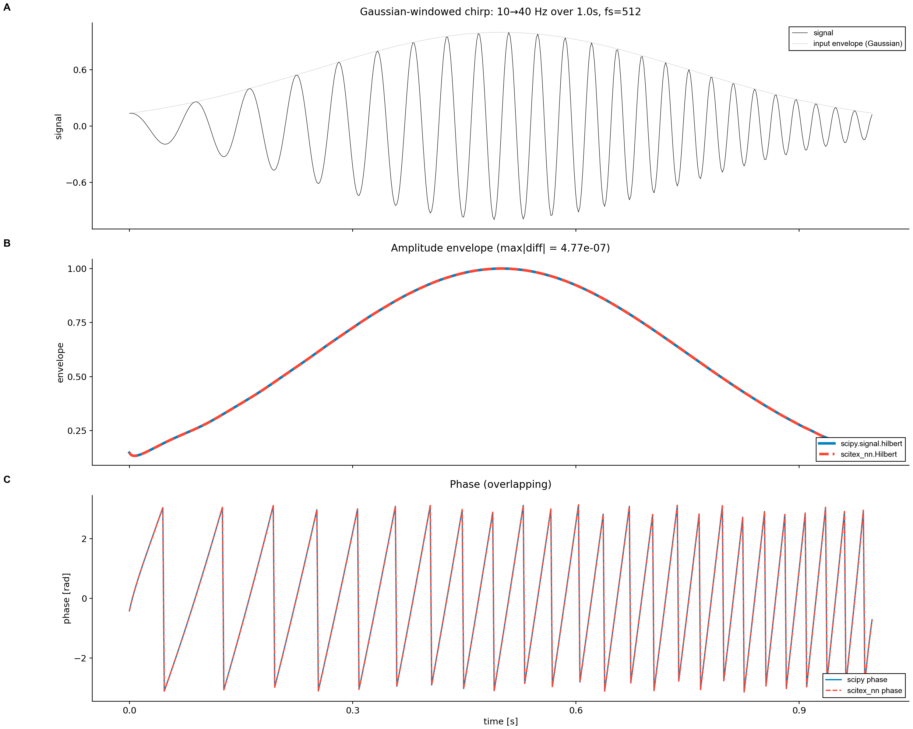 |
| [`examples/02_axiswise_dropout.py`](examples/02_axiswise_dropout.py) — `AxiswiseDropout` along `dim=1` (channels) and `dim=2` (time) vs element-wise | 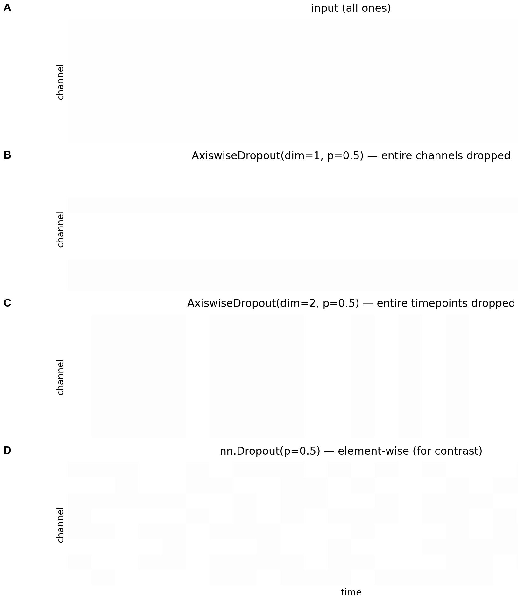 |
| [`examples/03_channel_aug.py`](examples/03_channel_aug.py) — `DropoutChannels` / `SwapChannels` / `ChannelGainChanger` side by side | 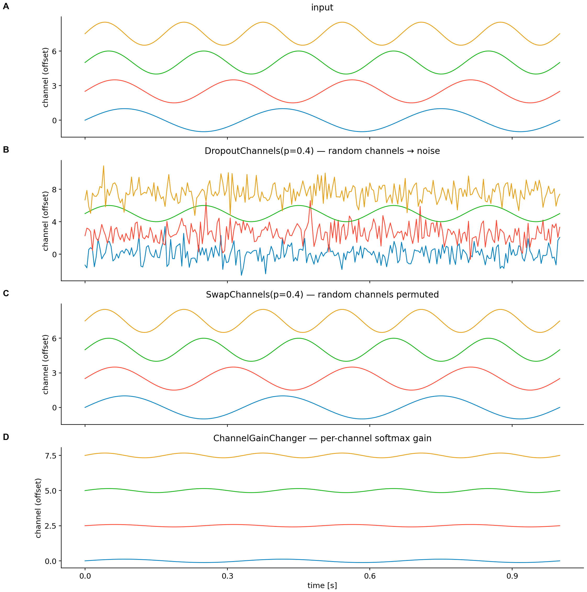 |
| [`examples/04_gaussian_filter.py`](examples/04_gaussian_filter.py) — `GaussianFilter` smoothing at three sigmas vs the clean reference | 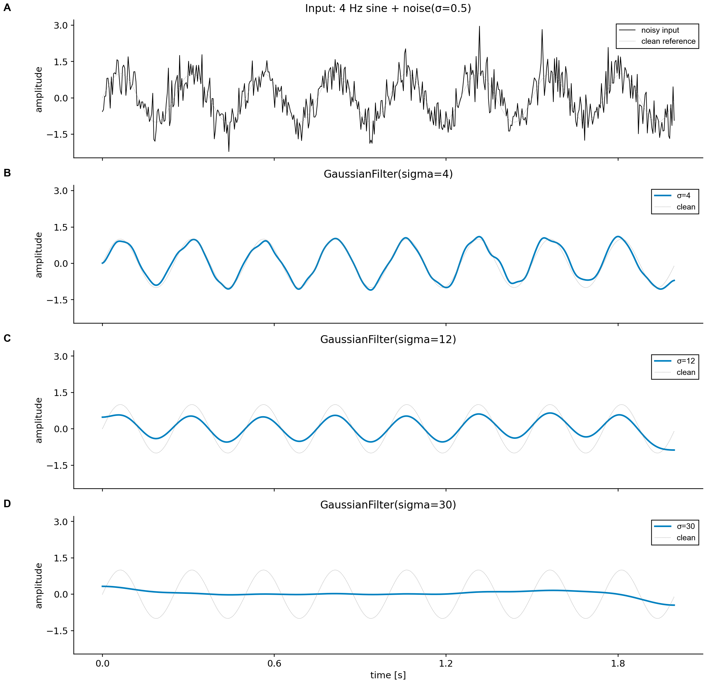 |
| [`examples/05_filter_bank.py`](examples/05_filter_bank.py) — Low/High/Band/BandStop frequency responses on one panel | 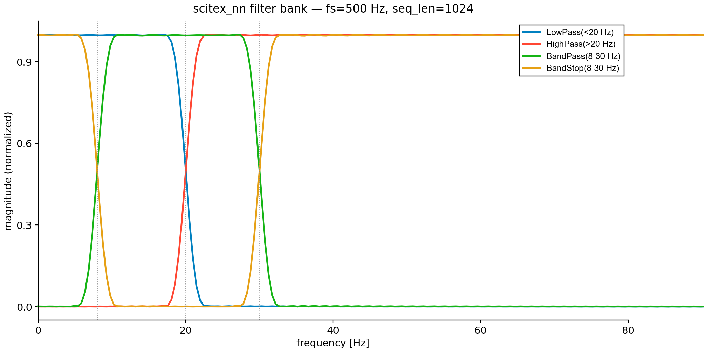 |
| [`examples/06_psd.py`](examples/06_psd.py) — `PSD` vs `scipy.signal.welch` on sine, two-tone, and 1/f noise | 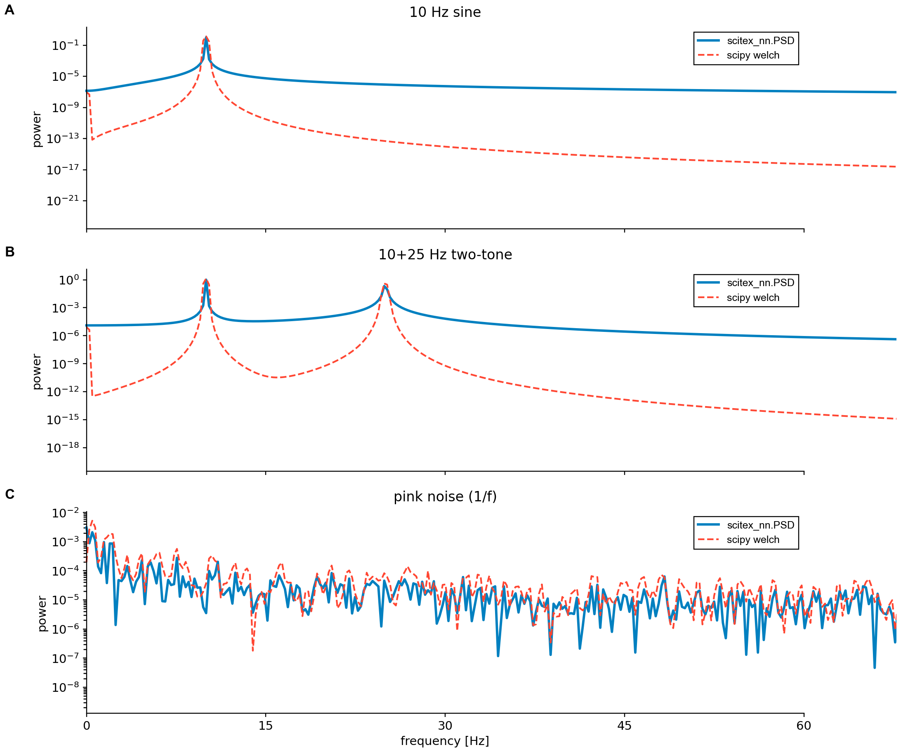 |
| [`examples/07_spectrogram.py`](examples/07_spectrogram.py) — STFT magnitude of a 5→60 Hz chirp, instantaneous-frequency overlay | 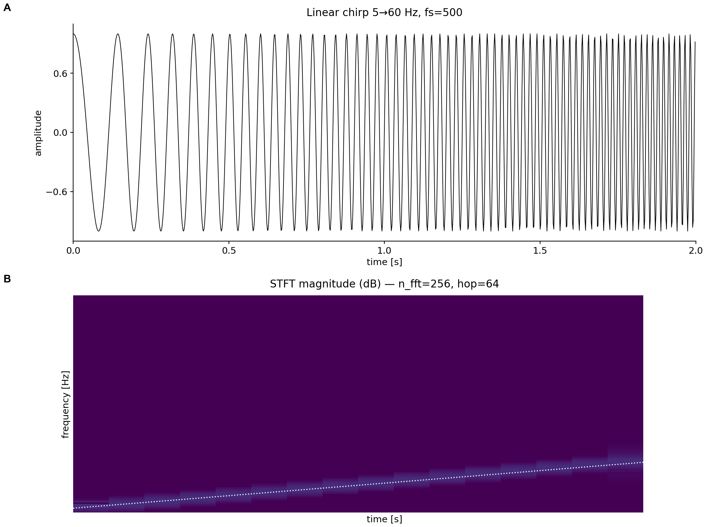 |
| [`examples/08_wavelet.py`](examples/08_wavelet.py) — Morlet CWT of the same chirp; adaptive time-frequency resolution | 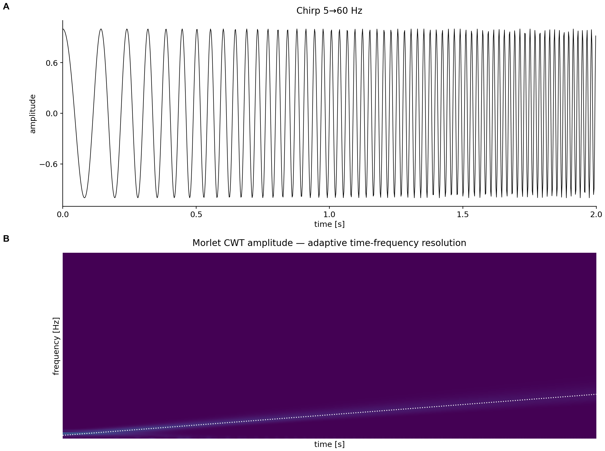 |
| [`examples/09_modulation_index.py`](examples/09_modulation_index.py) — Tort 2010 KL-MI on coupled vs uncoupled theta-gamma | 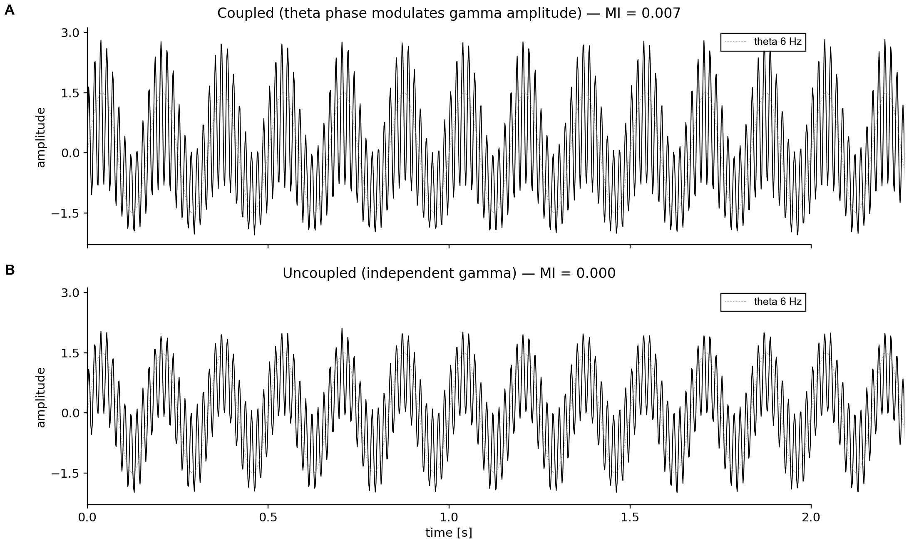 |
| [`examples/10_pac.py`](examples/10_pac.py) — `PAC` end-to-end comodulogram on synthetic theta-gamma | 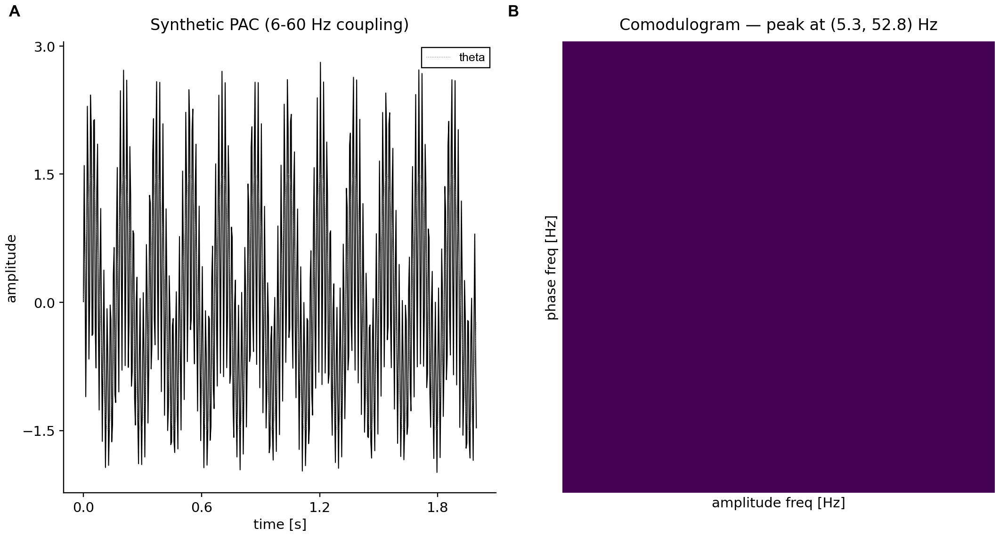 |
| [`examples/11_spatial_attention.py`](examples/11_spatial_attention.py) — channel-wise gain learned by `SpatialAttention` | 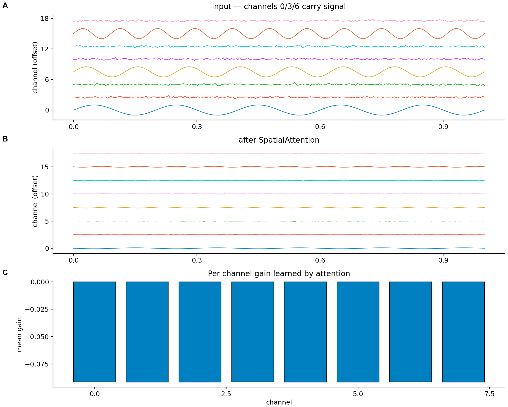 |
| [`examples/12_resnet1d.py`](examples/12_resnet1d.py) — `ResNet1D` training-loss curve on a 3-class synthetic problem | 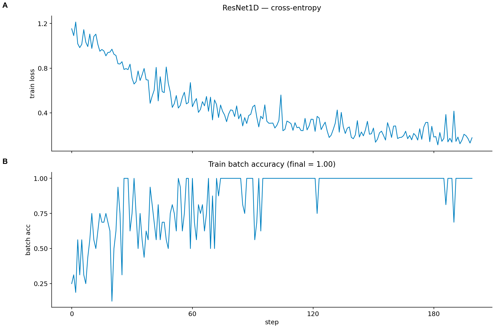 |
| [`examples/13_freq_gain_changer.py`](examples/13_freq_gain_changer.py) — random per-band frequency-domain gain on white noise | 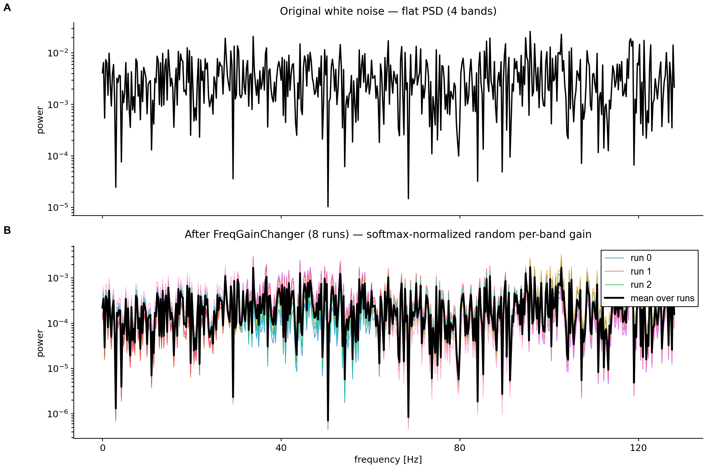 |
| [`examples/15_mnet_classifier.py`](examples/15_mnet_classifier.py) — `MNet1000` forward + backward + per-parameter gradient norms | 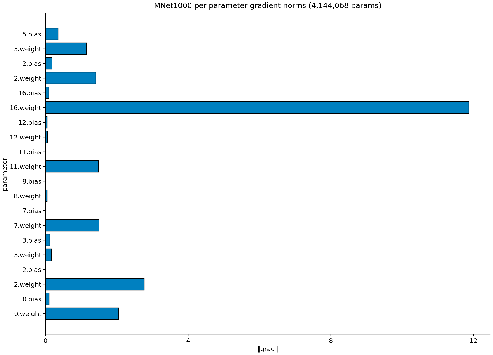 |

<details>
<summary><strong>Skills — for AI Agent Discovery</strong></summary>

<br>

Skills provide workflow-oriented guides that AI agents query to discover capabilities and usage patterns.

```bash
scitex-dev skills export --package scitex-nn  # Export to Claude Code
```

</details>

## Demo

The shortest end-to-end demo: differentiable Hilbert envelope on a
multi-channel signal, axis-wise dropout for SSL pre-training.

```python
import torch
import scitex_nn

x = torch.randn(8, 19, 1024)              # (batch, channels, samples)

env = scitex_nn.Hilbert(seq_len=1024)(x)  # analytic signal: (..., 2)
phase, amplitude = env[..., 0], env[..., 1]

drop = scitex_nn.AxiswiseDropout(dropout_prob=0.5, dim=1).train()
y = drop(x)                               # whole channels zeroed
```


For runnable examples covering every public class, see the [Gallery](#gallery)
above (each tile links to a self-contained `examples/<NN>_*.py`) and
`examples/00_run_all.sh` to dispatch the full set.

## Architecture

`scitex-nn` is a flat collection of `nn.Module`s grouped by what they do
to a `(batch, channels, samples)` tensor:

```
scitex_nn/
├── _Filters.py            # FIR-init bandpass / lowpass / highpass / bandstop
├── _GaussianFilter.py     # Gaussian smoothing (kernel = 6·sigma)
├── _Hilbert.py            # analytic-signal extraction (FFT-based)
├── _PSD.py                # power spectral density
├── _Spectrogram.py        # STFT magnitude per channel
├── _Wavelet.py            # Morlet CWT
├── _ModulationIndex.py    # Tort 2010 KL-MI
├── _PAC.py                # phase-amplitude coupling pipeline
├── _AxiswiseDropout.py    # axis-wise dropout (channel / time / feature)
├── _DropoutChannels.py    # whole-channel dropout
├── _ChannelGainChanger.py # softmax-weighted per-channel gain
├── _FreqGainChanger.py    # softmax-weighted per-band gain (julius)
├── _SwapChannels.py       # random channel permutation
├── _SpatialAttention.py   # 1×1 conv channel attention
├── _ResNet1D.py           # 1D ResNet backbone
├── _MNet_1000.py          # 4-stage Conv2d EEG/MEG classifier
├── _BNet.py / _BNet_Res.py# B-shaped multi-modality wrapper
└── _vendor_dsp_utils/     # vendored helpers (no scitex-dsp dep)
```

Modules compose as ordinary `nn.Sequential`. The signal-processing
layers operate on the last (time) axis; channel-aware augmentations
operate on `dim=1`.

## Available Modules

| Category | Modules |
|----------|---------|
| **Signal transforms** | `Hilbert`, `Wavelet`, `Spectrogram`, `PSD`, `Filters`, `GaussianFilter` |
| **Coupling / features** | `PAC`, `ModulationIndex` |
| **Dropout variants** | `AxiswiseDropout`, `DropoutChannels` |
| **Augmentation** | `ChannelGainChanger`, `FreqGainChanger`, `SwapChannels` |
| **Architectures** | `BNet`, `BNet_Res`, `MNet_1000`, `ResNet1D` |
| **Utilities** | `SpatialAttention`, `TransposeLayer` |

## Part of SciTeX

`scitex-nn` is part of [**SciTeX**](https://scitex.ai). Install via the
umbrella with `pip install scitex[nn]` to use as `scitex.nn` (Python).

```python
import scitex
import scitex_nn as nn

@scitex.session
def main(CONFIG=scitex.INJECTED):
    signal = scitex.io.load("signal.npy")
    hilbert = nn.Hilbert(seq_len=signal.shape[-1], dim=-1)
    out = hilbert(signal)
    scitex.io.save(out, "analytic.npy")
    return 0
```

The SciTeX system follows the Four Freedoms for Research below, inspired by [the Free Software Definition](https://www.gnu.org/philosophy/free-sw.en.html):

>Four Freedoms for Research
>
>0. The freedom to **run** your research anywhere — your machine, your terms.
>1. The freedom to **study** how every step works — from raw data to final manuscript.
>2. The freedom to **redistribute** your workflows, not just your papers.
>3. The freedom to **modify** any module and share improvements with the community.
>
>AGPL-3.0 — because we believe research infrastructure deserves the same freedoms as the software it runs on.

---

<p align="center">
  <a href="https://scitex.ai" target="_blank"></a>
</p>

<!-- EOF -->
